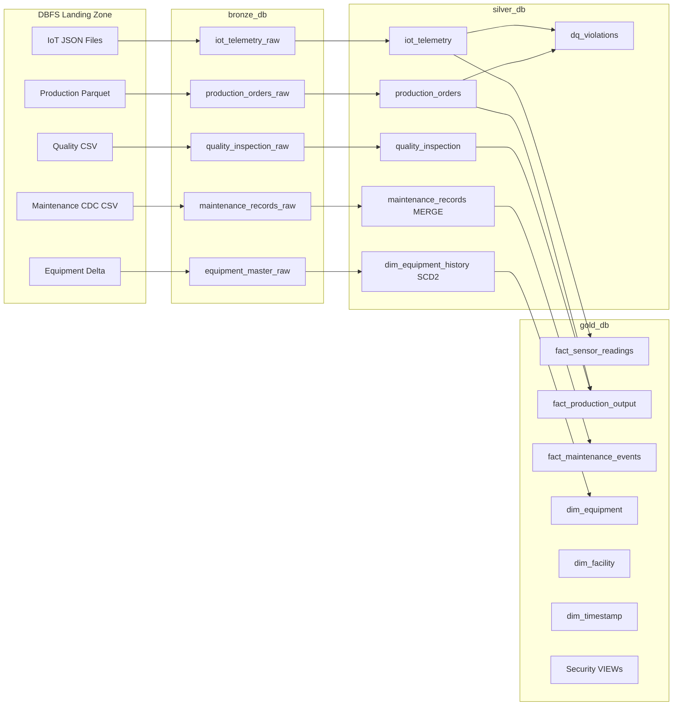

# Smart Manufacturing IoT Lakehouse — Hackathon Project Plan
### Databricks Community Edition | End-to-End Data Engineering Solution

---

## Table of Contents
1. [Document Analysis Summary](#1-document-analysis-summary)
2. [Community Edition Constraints & Adaptations](#2-community-edition-constraints--adaptations)
3. [Assumptions](#3-assumptions)
4. [Architecture Overview](#4-architecture-overview)
5. [Folder & Notebook Structure](#5-folder--notebook-structure)
6. [Phase-by-Phase Execution Plan](#6-phase-by-phase-execution-plan)
7. [Data Schemas & Sample Data Strategy](#7-data-schemas--sample-data-strategy)
8. [Pipeline Design: Bronze → Silver → Gold](#8-pipeline-design-bronze--silver--gold)
9. [Security & Governance Simulation](#9-security--governance-simulation)
10. [Performance Optimization Strategy](#10-performance-optimization-strategy)
11. [Testing & Validation Plan](#11-testing--validation-plan)
12. [Presentation & Delivery Strategy](#12-presentation--delivery-strategy)
13. [Potential Challenges & Mitigations](#13-potential-challenges--mitigations)
14. [Best Practices Checklist](#14-best-practices-checklist)

---

## 1. Document Analysis Summary

### Problem Statement
You are a Senior Data Engineer building a governed, scalable Lakehouse platform for a global smart manufacturing company. The platform must support real-time IoT monitoring, predictive maintenance, production quality tracking, and enterprise-grade data governance.

### 5 Data Sources (from Dataset Reference)

| # | Source | Format | Volume/Type | Key Fields | PII Columns |
|---|--------|--------|-------------|------------|-------------|
| 1 | IoT Sensor Telemetry | JSON | Streaming (100K events/hr) | device_id, facility_id, temperature, vibration, pressure, rpm | None |
| 2 | Production Orders | Parquet | Batch (ADLS Gen2 landing) | order_id, facility_id, equipment_id, priority | None |
| 3 | Maintenance Records | CDC Events | Incremental (SQL CDC) | maintenance_id, equipment_id, technician_id, downtime_minutes | maintenance_technician_id |
| 4 | Quality Inspection | CSV | Batch (ADLS Volumes) | inspection_id, order_id, units_rejected, defect_type | inspector_employee_id |
| 5 | Equipment Master | Delta Lake | SCD Type 2 source | equipment_id, serial_number, criticality_level | equipment_serial_number |

### Expected Deliverables (from Platform Doc Section 7)
1. Architecture Diagram
2. DLT Pipeline Code (Bronze/Silver/Gold)
3. Unity Catalog Implementation (DDL + Security)
4. CDC + SCD Type 2 Implementation
5. Data Quality Framework (DLT Expectations)
6. Workflow Orchestration
7. Performance Optimization Documentation
8. Test Plan & Results
9. README Documentation

---

## 2. Community Edition Constraints & Adaptations

Databricks Community Edition has significant limitations compared to full Azure Databricks. Every constraint has a documented workaround:

| Enterprise Feature | Community Edition Limitation | Adaptation / Workaround |
|---|---|---|
| Azure IoT Hub Streaming | No Azure services | Simulate with `spark.readStream` Rate Source or static JSON files read as stream |
| Delta Live Tables (DLT) | **NOT available** in Community Edition | Replace with structured Spark notebooks using Delta tables + manual orchestration |
| Unity Catalog | **NOT available** in Community Edition | Use Hive Metastore with database-level isolation (`bronze_db`, `silver_db`, `gold_db`) |
| ADLS Gen2 Storage | No external cloud storage | Use Databricks DBFS (`/dbfs/`) or FileStore as simulated landing zones |
| Azure Event Grid triggers | Not available | Simulate with notebook-based file polling loops |
| Azure Key Vault | Not available | Use Databricks Secrets (basic) or environment variable patterns |
| Multi-cluster workflows | Single-node cluster only | Sequence all pipelines within one cluster; use notebook workflows |
| Row/Column Security | No Unity Catalog RLS/CLS | Simulate via SQL VIEWs with WHERE filters and column masking functions |
| Autoloader (cloudFiles) | Requires premium subscription | Replace with `spark.readStream.format("json")` with schema hints |
| Bloom Filters | Supported in Delta | Use as-is |
| OPTIMIZE / ZORDER | **Supported** in Community Edition | Use as-is |
| Delta Change Data Feed | Supported | Use as-is (enable with `delta.enableChangeDataFeed = true`) |

---

## 3. Assumptions

Since Community Edition doesn't have Azure integration, the following assumptions apply:

**A1 — Data Generation:** All 5 datasets will be synthetically generated using Python/PySpark scripts that match the exact schemas in the Dataset Reference document. Volumes will be scaled to ~100K IoT records, ~1K orders, ~500 maintenance records, ~2K inspections, and 50 equipment records.

**A2 — Streaming Simulation:** IoT streaming is simulated using `spark.readStream.format("rate")` combined with UDFs that generate realistic telemetry payloads, OR by writing static JSON files to DBFS and reading them as a stream.

**A3 — CDC Simulation:** Maintenance Records CDC is simulated by generating a dataset with `_cdc_operation` (INSERT/UPDATE/DELETE), `_cdc_timestamp`, and `_lsn` columns.

**A4 — Storage:** All landing zones use DBFS paths (`dbfs:/landing/`, `dbfs:/delta/bronze/`, etc.) to simulate ADLS Gen2 folder structure.

**A5 — Unity Catalog → Hive Metastore:** Three databases (`bronze_db`, `silver_db`, `gold_db`) simulate the three-catalog namespace. All tables are Delta format.

**A6 — Security:** Row-level security is implemented via SQL VIEWs with `WHERE facility_id = current_user_facility()`. Column masking is implemented via VIEWs with `SHA2(sensitive_col, 256)` or `CONCAT(LEFT(col,3), '***')`.

**A7 — SCD Type 2:** Implemented using Delta `MERGE` statements with effective_start_date, effective_end_date, is_current, and version_number columns.

---

## 4. Architecture Overview

```
╔══════════════════════════════════════════════════════════════════════╗
║           SIMULATED DATA SOURCES (DBFS Landing Zones)               ║
║  /landing/iot_telemetry/    → JSON files (streamed)                  ║
║  /landing/production_orders/ → Parquet files (batch)                 ║
║  /landing/maintenance_records/ → CSV with CDC columns (batch)        ║
║  /landing/quality_inspection/  → CSV files (batch)                   ║
║  /landing/equipment_master/    → Delta table (reference)             ║
╚══════════╦═══════════════════════════════════════════════════════════╝
           ║
           ▼
╔══════════════════════════════════════╗
║  BRONZE LAYER  (bronze_db)           ║
║  Raw, append-only Delta tables       ║
║  Schema enforcement + rescue column  ║
║  Metadata: _ingestion_ts, _source    ║
╚══════════╦═══════════════════════════╝
           ║  Notebook-based pipelines
           ▼
╔══════════════════════════════════════╗
║  SILVER LAYER  (silver_db)           ║
║  Cleansed, deduplicated, validated   ║
║  DQ violations quarantine table      ║
║  CDF enabled on all tables           ║
║  CDC/SCD Type 2 applied              ║
╚══════════╦═══════════════════════════╝
           ║
           ▼
╔══════════════════════════════════════╗
║  GOLD LAYER  (gold_db)               ║
║  Star schema dimensional model       ║
║  3 Fact + 5 Dimension tables         ║
║  Security VIEWs for RBAC simulation  ║
╚══════════════════════════════════════╝
           ║
           ▼
╔══════════════════════════════════════╗
║  PRESENTATION / ANALYTICS            ║
║  Databricks SQL queries              ║
║  Notebook-based dashboards           ║
║  Test results & validation reports   ║
╚══════════════════════════════════════╝
```

### Medallion Layer Definitions

**Bronze** — Raw ingestion layer. No transformations. Append-only. Captures all data as-is including bad records. Schema enforcement with rescue column. Adds `_ingestion_timestamp`, `_source_file`, `_batch_id`.

**Silver** — Cleansed and enriched layer. Deduplication, null handling, type casting, business rule validation, DQ quarantine. CDC/SCD Type 2 processing. CDF enabled. Partitioned for performance.

**Gold** — Serving layer. Star schema. Aggregations and metrics. Security views simulate RBAC. Business-ready for analytics and ML feature engineering.

---

## 5. Folder & Notebook Structure

```
/Workspace/
└── SmartMfg_IoT_Lakehouse/
    ├── 00_Setup/
    │   ├── 00_Config.py                  # Global configs, paths, constants
    │   ├── 01_Create_Databases.py        # Create bronze_db, silver_db, gold_db
    │   └── 02_Data_Generator.py          # Synthetic data generation for all 5 sources
    │
    ├── 01_Bronze/
    │   ├── B01_IoT_Telemetry_Bronze.py   # Stream IoT JSON → bronze_db.iot_telemetry_raw
    │   ├── B02_Production_Orders_Bronze.py # Batch Parquet → bronze_db.production_orders_raw
    │   ├── B03_Maintenance_Records_Bronze.py # CDC CSV → bronze_db.maintenance_records_raw
    │   ├── B04_Quality_Inspection_Bronze.py  # CSV → bronze_db.quality_inspection_raw
    │   └── B05_Equipment_Master_Bronze.py    # Delta → bronze_db.equipment_master_raw
    │
    ├── 02_Silver/
    │   ├── S01_IoT_Telemetry_Silver.py   # Dedupe, validate, flatten → silver_db.iot_telemetry
    │   ├── S02_Production_Orders_Silver.py # Cleanse, enrich → silver_db.production_orders
    │   ├── S03_Maintenance_Records_Silver.py # CDC processing → silver_db.maintenance_records
    │   ├── S04_Quality_Inspection_Silver.py  # Validate → silver_db.quality_inspection
    │   ├── S05_Equipment_Master_SCD2.py      # SCD Type 2 → silver_db.dim_equipment_history
    │   └── S06_DQ_Framework.py               # Data Quality violations table + reporting
    │
    ├── 03_Gold/
    │   ├── G01_Dim_Tables.py             # dim_facility, dim_timestamp, dim_technician, dim_production_order
    │   ├── G02_Dim_Equipment_SCD2.py     # dim_equipment (SCD Type 2 from Silver)
    │   ├── G03_Fact_Sensor_Readings.py   # fact_sensor_readings
    │   ├── G04_Fact_Production_Output.py # fact_production_output
    │   ├── G05_Fact_Maintenance_Events.py # fact_maintenance_events
    │   └── G06_Security_Views.py         # RLS and CLS simulation VIEWs
    │
    ├── 04_Optimization/
    │   ├── OPT01_Partitioning_Strategy.py   # Apply partitioning to all tables
    │   ├── OPT02_ZOrder_Optimize.py         # OPTIMIZE + ZORDER scripts
    │   ├── OPT03_Bloom_Filters.py           # Bloom filter creation
    │   └── OPT04_Vacuum_Maintenance.py      # VACUUM + auto-compaction settings
    │
    ├── 05_Testing/
    │   ├── T01_Bronze_Validation.py         # Row counts, schema checks Bronze
    │   ├── T02_Silver_DQ_Tests.py           # DQ rule validation tests
    │   ├── T03_SCD2_Tests.py                # SCD Type 2 correctness tests
    │   ├── T04_Gold_Integrity_Tests.py      # Referential integrity, counts
    │   ├── T05_Security_Tests.py            # RLS/CLS behavior simulation
    │   ├── T06_Streaming_Tests.py           # Late-arriving, duplicates, malformed
    │   └── T07_Performance_Tests.py         # Query timing before/after optimization
    │
    ├── 06_Orchestration/
    │   └── MASTER_Pipeline_Runner.py        # Runs all phases sequentially
    │
    └── README.md                            # Setup and execution guide
```

---

## 6. Phase-by-Phase Execution Plan

### Phase 0 — Environment Setup (Day 1, ~2 hours)

**Goal:** Initialize workspace, databases, and synthetic data.

**Steps:**
1. Create workspace folder structure in Databricks Community Edition
2. Run `00_Config.py` — define all DBFS paths, database names, table names as variables
3. Run `01_Create_Databases.py` — create `bronze_db`, `silver_db`, `gold_db` using `CREATE DATABASE IF NOT EXISTS`
4. Run `02_Data_Generator.py` — generate all 5 synthetic datasets and write to DBFS landing zones

**Key outputs:**
- `dbfs:/landing/iot_telemetry/` — 10+ JSON files, ~10K records each
- `dbfs:/landing/production_orders/` — Parquet files
- `dbfs:/landing/maintenance_records/` — CSV with CDC columns
- `dbfs:/landing/quality_inspection/` — CSV files
- `dbfs:/delta/equipment_master/` — Delta table with 50 equipment rows

**Data Generation Notes:**
- IoT: 4 facilities × 5 device types × 50 timestamps = realistic spread
- Include intentional bad records: 5% NULLs in required fields, 3% out-of-range values, 2% duplicate device_id+timestamp pairs
- Maintenance: Include UPDATE and DELETE CDC operations for SCD testing
- Equipment: Include 2–3 equipment spec changes to trigger SCD Type 2 versions

---

### Phase 1 — Bronze Layer Ingestion (Day 1–2, ~4 hours)

**Goal:** Raw data ingestion with metadata capture. No business logic.

**IoT Telemetry (Streaming simulation):**
```python
# Simulate streaming by reading JSON files as a stream
raw_stream = (spark.readStream
    .format("json")
    .schema(iot_schema)
    .option("maxFilesPerTrigger", 1)
    .load("dbfs:/landing/iot_telemetry/"))

bronze_iot = raw_stream.withColumn("_ingestion_timestamp", current_timestamp()) \
    .withColumn("_source_file", input_file_name()) \
    .withColumn("_batch_id", lit(str(uuid.uuid4())))

bronze_iot.writeStream.format("delta") \
    .outputMode("append") \
    .option("checkpointLocation", "dbfs:/checkpoints/bronze/iot") \
    .partitionBy("facility_id") \
    .toTable("bronze_db.iot_telemetry_raw")
```

**Production Orders (Batch with Autoloader simulation):**
```python
# Simulated Autoloader using structured streaming on files
df = spark.read.format("parquet") \
    .option("rescuedDataColumn", "_rescued_data") \
    .load("dbfs:/landing/production_orders/")
df.withColumn("_ingestion_timestamp", current_timestamp()) \
    .withColumn("_input_file_name", input_file_name()) \
    .write.format("delta").mode("append") \
    .partitionBy("facility_id") \
    .saveAsTable("bronze_db.production_orders_raw")
```

**Tables created in Bronze:**
- `bronze_db.iot_telemetry_raw`
- `bronze_db.production_orders_raw`
- `bronze_db.maintenance_records_raw`
- `bronze_db.quality_inspection_raw`
- `bronze_db.equipment_master_raw`

**Bronze Table Properties:**
```sql
ALTER TABLE bronze_db.iot_telemetry_raw
SET TBLPROPERTIES (
  'delta.enableChangeDataFeed' = 'false',
  'delta.autoOptimize.optimizeWrite' = 'true',
  'delta.autoOptimize.autoCompact' = 'true',
  'comment' = 'Raw IoT telemetry — append only, no transformations'
);
```

---

### Phase 2 — Silver Layer Cleansing & Validation (Day 2–3, ~6 hours)

**Goal:** Cleansed, deduplicated, validated data with DQ enforcement.

#### 2A — IoT Telemetry Silver
```python
# Deduplication
from delta.tables import DeltaTable

silver_iot = bronze_iot.dropDuplicates(["device_id", "event_timestamp"]) \
    .filter(col("device_id").isNotNull()) \
    .filter(col("event_timestamp").isNotNull()) \
    .filter(col("facility_id").isNotNull()) \
    .filter((col("temperature") >= -50) & (col("temperature") <= 150)) \
    .filter((col("vibration_x") >= 0) & (col("vibration_x") <= 100)) \
    .withColumn("event_date", to_date("event_timestamp"))

# Write passing records to silver
silver_iot.filter(col("_dq_passed") == True) \
    .write.format("delta").mode("append") \
    .partitionBy("event_date", "facility_id") \
    .saveAsTable("silver_db.iot_telemetry")

# Write failing records to DQ violations
silver_iot.filter(col("_dq_passed") == False) \
    .withColumn("violated_rule", col("_violation_reason")) \
    .write.format("delta").mode("append") \
    .saveAsTable("silver_db.dq_violations")
```

#### 2B — CDC Processing for Maintenance Records
```python
# Apply CDC operations: INSERT → upsert, DELETE → soft delete, UPDATE → upsert
from delta.tables import DeltaTable

target = DeltaTable.forName(spark, "silver_db.maintenance_records")

# Process INSERTs and UPDATEs
inserts_updates = cdc_df.filter(col("_cdc_operation").isin(["INSERT", "UPDATE"]))
target.alias("t").merge(
    inserts_updates.alias("s"),
    "t.maintenance_id = s.maintenance_id"
).whenMatchedUpdateAll() \
 .whenNotMatchedInsertAll() \
 .execute()

# Soft delete for DELETE operations
deletes = cdc_df.filter(col("_cdc_operation") == "DELETE")
target.alias("t").merge(
    deletes.alias("s"),
    "t.maintenance_id = s.maintenance_id"
).whenMatchedUpdate(set={"is_deleted": "true", "deleted_at": "current_timestamp()"}) \
 .execute()
```

#### 2C — SCD Type 2 for Equipment Master
```python
def apply_scd2(spark, source_df, target_table):
    target = DeltaTable.forName(spark, target_table)
    
    # Detect changed records
    changes = source_df.alias("s").join(
        target.toDF().filter("is_current = true").alias("t"),
        "equipment_id"
    ).filter("s.equipment_status != t.equipment_status OR s.rated_capacity != t.rated_capacity")
    
    # Expire old records
    target.alias("t").merge(
        changes.alias("s"),
        "t.equipment_id = s.equipment_id AND t.is_current = true"
    ).whenMatchedUpdate(set={
        "is_current": "false",
        "effective_end_date": "current_date()",
    }).execute()
    
    # Insert new versions
    new_versions = changes.withColumn("effective_start_date", current_date()) \
        .withColumn("effective_end_date", lit(None).cast("date")) \
        .withColumn("is_current", lit(True)) \
        .withColumn("version_number", col("version_number") + 1)
    
    new_versions.write.format("delta").mode("append").saveAsTable(target_table)
```

**Silver Tables:**
- `silver_db.iot_telemetry` — partitioned by (event_date, facility_id), CDF enabled
- `silver_db.production_orders` — partitioned by (facility_id, start_date)
- `silver_db.maintenance_records` — upserted via MERGE
- `silver_db.quality_inspection` — validated, partitioned
- `silver_db.dim_equipment_history` — SCD Type 2 with version tracking
- `silver_db.dq_violations` — all DQ failures with rule and source info

#### 2D — Data Quality Framework

Implement a centralized DQ engine that applies these rules:

| Rule ID | Dataset | Field | Rule Type | Action |
|---------|---------|-------|-----------|--------|
| DQ-001 | IoT | device_id | NOT NULL | Quarantine |
| DQ-002 | IoT | event_timestamp | NOT NULL | Drop |
| DQ-003 | IoT | facility_id | NOT NULL | Quarantine |
| DQ-004 | IoT | temperature | Range: -50 to 150°C | Warn + flag |
| DQ-005 | IoT | vibration_x | Range: 0 to 100 Hz | Warn + flag |
| DQ-006 | IoT | facility_id | EXISTS IN dim_facility | Quarantine |
| DQ-007 | IoT | event_timestamp | Freshness < 15 min | Warn |
| DQ-008 | IoT | device_id | Pattern: [A-Z]+-FAC\d+-\d+ | Warn |
| DQ-009 | Maintenance | maintenance_id | NOT NULL | Drop |
| DQ-010 | Quality | order_id | EXISTS IN production_orders | Warn |

```python
# DQ violations schema
dq_violations_schema = StructType([
    StructField("violation_id", StringType()),
    StructField("source_table", StringType()),
    StructField("record_key", StringType()),
    StructField("violated_rule_id", StringType()),
    StructField("violated_rule_desc", StringType()),
    StructField("field_name", StringType()),
    StructField("field_value", StringType()),
    StructField("action_taken", StringType()),  # DROP, QUARANTINE, WARN
    StructField("detected_at", TimestampType()),
    StructField("pipeline_run_id", StringType()),
])
```

---

### Phase 3 — Gold Layer Dimensional Model (Day 3–4, ~5 hours)

**Goal:** Star schema implementation for analytics and reporting.

#### Dimension Tables

**dim_facility** (reference data, static load):
```sql
CREATE TABLE gold_db.dim_facility (
  facility_sk BIGINT GENERATED ALWAYS AS IDENTITY,
  facility_id STRING NOT NULL,
  facility_name STRING,
  region STRING,
  country STRING,
  city STRING,
  timezone STRING,
  facility_status STRING,
  _load_timestamp TIMESTAMP
) USING DELTA;
```

**dim_timestamp** (pre-populated 2025–2027):
```python
# Generate date dimension covering 2025-01-01 to 2027-12-31
from pyspark.sql.functions import explode, sequence, to_date, year, month, dayofweek, quarter, weekofyear

date_range = spark.sql("SELECT explode(sequence(to_date('2025-01-01'), to_date('2027-12-31'), interval 1 day)) as date_day")
dim_ts = date_range.withColumn("timestamp_sk", date_format("date_day", "yyyyMMdd").cast("int")) \
    .withColumn("year", year("date_day")) \
    .withColumn("month", month("date_day")) \
    .withColumn("quarter", quarter("date_day")) \
    .withColumn("week_of_year", weekofyear("date_day")) \
    .withColumn("day_of_week", dayofweek("date_day")) \
    .withColumn("is_weekend", when(dayofweek("date_day").isin([1,7]), True).otherwise(False))
```

**dim_equipment** (from SCD2 — is_current = true):
```sql
CREATE OR REPLACE VIEW gold_db.dim_equipment AS
SELECT
  equipment_sk,
  equipment_id,
  SHA2(equipment_serial_number, 256) AS equipment_serial_number_masked,  -- CLS masking
  facility_id,
  equipment_type,
  manufacturer,
  model_number,
  equipment_status,
  asset_value_usd,
  criticality_level,
  effective_start_date,
  effective_end_date,
  is_current,
  version_number
FROM silver_db.dim_equipment_history;
```

#### Fact Tables

**fact_sensor_readings:**
```sql
CREATE TABLE gold_db.fact_sensor_readings (
  sensor_reading_sk BIGINT GENERATED ALWAYS AS IDENTITY,
  equipment_sk BIGINT,
  facility_sk BIGINT,
  timestamp_sk INT,
  device_id STRING,
  event_timestamp TIMESTAMP,
  temperature DOUBLE,
  vibration_x DOUBLE,
  vibration_y DOUBLE,
  vibration_z DOUBLE,
  pressure DOUBLE,
  power_consumption DOUBLE,
  rpm INT,
  is_anomaly BOOLEAN,
  anomaly_score DOUBLE,
  _ingestion_timestamp TIMESTAMP,
  _pipeline_run_id STRING
) USING DELTA
PARTITIONED BY (timestamp_sk, facility_sk);
```

**fact_production_output:**
```sql
CREATE TABLE gold_db.fact_production_output (
  production_sk BIGINT GENERATED ALWAYS AS IDENTITY,
  order_sk BIGINT,
  equipment_sk BIGINT,
  facility_sk BIGINT,
  timestamp_sk INT,
  inspection_sk BIGINT,
  units_produced INT,
  units_passed INT,
  units_rejected INT,
  defect_count INT,
  defect_rate DOUBLE,
  yield_rate DOUBLE,
  _pipeline_run_id STRING
) USING DELTA
PARTITIONED BY (timestamp_sk, facility_sk);
```

**fact_maintenance_events:**
```sql
CREATE TABLE gold_db.fact_maintenance_events (
  maintenance_sk BIGINT GENERATED ALWAYS AS IDENTITY,
  equipment_sk BIGINT,
  technician_sk BIGINT,
  facility_sk BIGINT,
  timestamp_sk INT,
  maintenance_id STRING,
  maintenance_type STRING,
  downtime_minutes INT,
  maintenance_cost_usd DOUBLE,
  failure_code STRING,
  _pipeline_run_id STRING
) USING DELTA
PARTITIONED BY (timestamp_sk, facility_sk);
```

---

### Phase 4 — Security Simulation (Day 4, ~2 hours)

Since Unity Catalog is unavailable in Community Edition, implement security via SQL Views:

#### Row-Level Security (RLS)

```sql
-- Simulate current user's facility mapping (in production: use session variables)
CREATE OR REPLACE FUNCTION gold_db.get_user_facility()
RETURNS STRING
RETURN CASE current_user()
  WHEN 'analyst_na@company.com' THEN 'FAC-NA-001'
  WHEN 'analyst_eu@company.com' THEN 'FAC-EU-003'
  WHEN 'analyst_apac@company.com' THEN 'FAC-APAC-002'
  ELSE 'ALL'  -- Data Engineer / Admin
END;

-- RLS View for Data Analysts
CREATE OR REPLACE VIEW gold_db.vw_analyst_sensor_readings AS
SELECT * FROM gold_db.fact_sensor_readings
WHERE facility_sk IN (
  SELECT facility_sk FROM gold_db.dim_facility
  WHERE facility_id = gold_db.get_user_facility()
  OR gold_db.get_user_facility() = 'ALL'
);
```

#### Column-Level Security (CLS) — Data Masking

```sql
-- Masked view for analysts (PII columns masked)
CREATE OR REPLACE VIEW silver_db.vw_maintenance_analyst AS
SELECT
  maintenance_id,
  equipment_id,
  facility_id,
  maintenance_type,
  CONCAT(LEFT(maintenance_technician_id, 5), '***') AS maintenance_technician_id,  -- Masked
  start_datetime,
  end_datetime,
  downtime_minutes,
  failure_code,
  maintenance_cost_usd
FROM silver_db.maintenance_records;

-- Full access view for Data Engineers (no masking)
CREATE OR REPLACE VIEW silver_db.vw_maintenance_engineer AS
SELECT * FROM silver_db.maintenance_records;
```

#### RBAC Role Definitions (simulated as SQL comments + views)

| Role | Views Accessible | Masking Applied |
|------|-----------------|-----------------|
| data_analyst | gold_db.vw_analyst_* | PII masked, facility-filtered |
| ml_engineer | silver_db.vw_ml_*, gold_db.* | No PII, regional filter |
| data_engineer | All tables, direct | No masking |
| auditor | silver_db.dq_violations, audit_log | Read-only |

---

## 7. Data Schemas & Sample Data Strategy

### Synthetic Data Generator Structure (02_Data_Generator.py)

```python
import uuid, random
from datetime import datetime, timedelta
from pyspark.sql import SparkSession
from pyspark.sql.functions import *

FACILITIES = ["FAC-NA-001", "FAC-EU-003", "FAC-APAC-002", "FAC-NA-002"]
EQUIPMENT_TYPES = ["CNC_MACHINE", "HYDRAULIC_PRESS", "CENTRIFUGAL_PUMP", "WELDING_ROBOT"]
DEVICE_PREFIX_MAP = {"CNC_MACHINE": "CNC", "HYDRAULIC_PRESS": "PRESS",
                     "CENTRIFUGAL_PUMP": "PUMP", "WELDING_ROBOT": "ROBOT"}

def generate_iot_records(n=50000):
    records = []
    for _ in range(n):
        fac = random.choice(FACILITIES)
        eq_type = random.choice(EQUIPMENT_TYPES)
        prefix = DEVICE_PREFIX_MAP[eq_type]
        fac_short = fac.split("-")[1] + fac.split("-")[2][:2]
        device_id = f"{prefix}-{fac_short}-{random.randint(1,99):04d}"
        
        # Introduce intentional anomalies
        temp = random.gauss(70, 10)
        if random.random() < 0.02:  # 2% anomalous
            temp = random.choice([-60, 200])  # Out of range
        
        record = {
            "device_id": device_id if random.random() > 0.01 else None,  # 1% NULL
            "facility_id": fac if random.random() > 0.005 else "FAC-INVALID-999",  # 0.5% bad FK
            "equipment_type": eq_type,
            "event_timestamp": (datetime.now() - timedelta(seconds=random.randint(0, 3600))).isoformat() + "Z",
            "temperature": round(temp, 1),
            "vibration_x": round(abs(random.gauss(2.5, 1)), 2),
            "pressure": round(random.uniform(100, 250), 1),
            "power_consumption": round(random.uniform(8, 25), 1),
            "rpm": random.randint(1000, 4000),
        }
        records.append(record)
    return records
```

---

## 8. Pipeline Design: Bronze → Silver → Gold

### Data Flow Summary

```
IoT JSON files     → B01_IoT_Bronze → S01_IoT_Silver → G03_Fact_Sensor_Readings
Production Parquet → B02_Prod_Bronze → S02_Prod_Silver → G04_Fact_Production_Output
Maintenance CDC    → B03_Maint_Bronze → S03_Maint_Silver (MERGE) → G05_Fact_Maintenance
Quality CSV        → B04_QI_Bronze → S04_QI_Silver → G04_Fact_Production_Output (joined)
Equipment Delta    → B05_Equip_Bronze → S05_SCD2 → G02_Dim_Equipment
```

### Change Data Feed Configuration

```sql
-- Enable CDF on all Silver and Gold tables
ALTER TABLE silver_db.iot_telemetry
SET TBLPROPERTIES ('delta.enableChangeDataFeed' = 'true');

-- Reading CDF changes (for downstream Gold refresh)
SELECT * FROM table_changes('silver_db.iot_telemetry', 1)
WHERE _change_type IN ('insert', 'update_postimage');
```

### Streaming vs. Batch Strategy

| Pipeline | Mode | Trigger | Target Latency |
|----------|------|---------|----------------|
| IoT Telemetry Bronze | Structured Streaming | `processingTime = "30 seconds"` | Near real-time |
| IoT Telemetry Silver | Structured Streaming | `processingTime = "1 minute"` | < 2 min |
| Production Orders | Batch | On file arrival | < 5 min |
| Maintenance Records | Micro-batch | Every 10 min | < 15 min |
| Quality Inspection | Batch | On file arrival | < 5 min |
| Gold Layer | Triggered batch | After Silver completes | < 10 min |

---

## 9. Security & Governance Simulation

### Audit Logging Table

```sql
CREATE TABLE silver_db.audit_log (
  audit_id STRING DEFAULT UUID(),
  event_timestamp TIMESTAMP DEFAULT CURRENT_TIMESTAMP(),
  user_identity STRING,
  action_type STRING,      -- READ, WRITE, SCHEMA_CHANGE, SECURITY_VIOLATION
  target_table STRING,
  target_database STRING,
  rows_affected LONG,
  query_text STRING,
  session_id STRING,
  pipeline_run_id STRING
) USING DELTA;
```

Each pipeline notebook appends an audit record at completion using:
```python
spark.sql(f"""
INSERT INTO silver_db.audit_log 
VALUES (uuid(), current_timestamp(), '{current_user}', 'WRITE', 
        '{table_name}', '{database}', {rows_written}, '{query}', '{session_id}', '{run_id}')
""")
```

---

## 10. Performance Optimization Strategy

### Partitioning Strategy

| Table | Partition Columns | Rationale |
|-------|------------------|-----------|
| bronze_db.iot_telemetry_raw | facility_id | High cardinality date causes too many partitions |
| silver_db.iot_telemetry | event_date, facility_id | Enables date-range + facility queries |
| gold_db.fact_sensor_readings | timestamp_sk, facility_sk | Star schema query patterns |
| gold_db.fact_maintenance_events | timestamp_sk | Time-series analytics |

### Z-Ordering Scripts

```python
# Run after data load
spark.sql("OPTIMIZE silver_db.iot_telemetry ZORDER BY (equipment_id, device_id)")
spark.sql("OPTIMIZE gold_db.fact_sensor_readings ZORDER BY (equipment_sk, event_timestamp)")
spark.sql("OPTIMIZE silver_db.maintenance_records ZORDER BY (equipment_id, maintenance_type)")
```

### Bloom Filters

```sql
-- High cardinality join columns benefit most
ALTER TABLE silver_db.iot_telemetry
SET TBLPROPERTIES (
  'delta.dataSkippingNumIndexedCols' = '5',
  'delta.bloomFilter.device_id.fpp' = '0.01',
  'delta.bloomFilter.device_id.numItems' = '10000000'
);
```

### Auto-Compaction & Optimize Writes

```sql
-- Set on all fact tables
ALTER TABLE gold_db.fact_sensor_readings
SET TBLPROPERTIES (
  'delta.autoOptimize.optimizeWrite' = 'true',
  'delta.autoOptimize.autoCompact' = 'true',
  'delta.targetFileSize' = '134217728'  -- 128MB target
);
```

### VACUUM Policy

```python
# Retention: 7 days for production (168 hours)
spark.sql("VACUUM silver_db.iot_telemetry RETAIN 168 HOURS")
spark.sql("VACUUM gold_db.fact_sensor_readings RETAIN 168 HOURS")

# For testing: can reduce to 0 hours (disable safety check)
spark.conf.set("spark.databricks.delta.retentionDurationCheck.enabled", "false")
spark.sql("VACUUM bronze_db.iot_telemetry_raw RETAIN 0 HOURS")
```

### Performance Benchmarking Notebook (T07)

```python
# Before optimization
start = time.time()
spark.sql("SELECT facility_id, AVG(temperature) FROM silver_db.iot_telemetry GROUP BY 1").collect()
t_before = time.time() - start

# After OPTIMIZE + ZORDER
spark.sql("OPTIMIZE silver_db.iot_telemetry ZORDER BY (device_id)")
start = time.time()
spark.sql("SELECT facility_id, AVG(temperature) FROM silver_db.iot_telemetry GROUP BY 1").collect()
t_after = time.time() - start

print(f"Before: {t_before:.2f}s | After: {t_after:.2f}s | Improvement: {(1 - t_after/t_before)*100:.1f}%")
```

---

## 11. Testing & Validation Plan

### Test Matrix

#### T01 — Bronze Validation
| Test | Method | Expected |
|------|--------|----------|
| Row count preserved | `COUNT(*)` before/after | Bronze rows ≥ source rows |
| Schema match | `df.schema == expected_schema` | Exact match |
| Metadata columns present | Column existence check | _ingestion_timestamp, _source_file present |
| No transformations | Column value comparison | Raw values unchanged |
| Append-only behavior | Check Delta history | Only `WRITE` operations |

#### T02 — Silver DQ Tests
| Test | Input | Expected |
|------|-------|----------|
| NULL device_id | Record with device_id=NULL | Quarantined to dq_violations |
| Temperature = -200°C | Out-of-range temp | Flagged, action per rule |
| Invalid facility_id | FAC-INVALID-999 | Quarantined (referential integrity) |
| Duplicate device+timestamp | 2 identical records | Only 1 in Silver |
| Stale data (>15 min old) | Old timestamp | Warning flag set |

#### T03 — SCD Type 2 Tests
```python
def test_scd2_new_version():
    # Insert equipment record
    # Update equipment_status
    # Verify: original record has is_current=False, effective_end_date set
    # Verify: new record has is_current=True, version_number incremented
    old = spark.sql("SELECT * FROM silver_db.dim_equipment_history WHERE equipment_id='EQ-CNC-0012' AND is_current=False")
    new = spark.sql("SELECT * FROM silver_db.dim_equipment_history WHERE equipment_id='EQ-CNC-0012' AND is_current=True")
    assert old.count() >= 1, "Old version should be expired"
    assert new.count() == 1, "Exactly one current version"
    assert new.first()["version_number"] > old.first()["version_number"]
```

#### T04 — Gold Integrity Tests
| Test | Query | Expected |
|------|-------|----------|
| Fact-Dim join completeness | LEFT JOIN dim, count NULLs | < 1% unmatchable |
| No orphaned facts | WHERE equipment_sk NOT IN dim | 0 records |
| Timestamp coverage | date range check | All dates in dim_timestamp |
| Aggregation accuracy | SUM(units_produced) vs silver | Exact match |

#### T05 — Security Tests
```python
# Test 1: RLS — Analyst should only see their facility
result = spark.sql("""
  SELECT DISTINCT facility_id FROM gold_db.vw_analyst_sensor_readings
  WHERE gold_db.get_user_facility() = 'FAC-NA-001'
""")
assert result.count() == 1 and result.first()["facility_id"] == "FAC-NA-001"

# Test 2: CLS — technician_id should be masked
result = spark.sql("SELECT maintenance_technician_id FROM silver_db.vw_maintenance_analyst LIMIT 1")
assert "***" in result.first()["maintenance_technician_id"]
```

#### T06 — Streaming Edge Cases
| Scenario | Simulation | Expected Behavior |
|----------|-----------|-------------------|
| Late-arriving events | Inject records with timestamp 1 hour old | Processed but flagged as late |
| Duplicate messages | Write same device+timestamp twice to landing | Deduplicated in Silver |
| Schema evolution | Add new field to JSON | Rescued in `_rescued_data` column |
| Malformed JSON | Write `{broken json` to landing | Error handled, logged to DQ violations |
| Out-of-order events | Random timestamp shuffle | Watermark handles correctly |

---

## 12. Presentation & Delivery Strategy

### Deliverable Package

Within Databricks Community Edition, export and organize:

1. **Databricks Archive (.dbc file)** — Export entire `SmartMfg_IoT_Lakehouse/` folder as a `.dbc` archive. This can be imported by any evaluator.

2. **README.md** (in the workspace root) — Clear setup instructions, architecture decisions, assumptions.

3. **Architecture Diagram** — Create using draw.io (free) or mermaid diagram in a notebook markdown cell.

4. **Test Results Notebook** — Run `T01` through `T07` notebooks and export as HTML for offline viewing.

5. **Demonstration Script** — `MASTER_Pipeline_Runner.py` runs the full end-to-end pipeline from data generation to Gold layer with a single cell execution.

### Architecture Diagram (Mermaid — embed in notebook)



### MASTER_Pipeline_Runner.py Structure

```python
# Cell 1: Setup & Config
%run ./00_Setup/00_Config

# Cell 2: Generate Data
%run ./00_Setup/02_Data_Generator

# Cell 3: Bronze Layer
%run ./01_Bronze/B01_IoT_Telemetry_Bronze
%run ./01_Bronze/B02_Production_Orders_Bronze
%run ./01_Bronze/B03_Maintenance_Records_Bronze
%run ./01_Bronze/B04_Quality_Inspection_Bronze
%run ./01_Bronze/B05_Equipment_Master_Bronze

# Cell 4: Silver Layer
%run ./02_Silver/S01_IoT_Telemetry_Silver
%run ./02_Silver/S02_Production_Orders_Silver
%run ./02_Silver/S03_Maintenance_Records_Silver
%run ./02_Silver/S04_Quality_Inspection_Silver
%run ./02_Silver/S05_Equipment_Master_SCD2
%run ./02_Silver/S06_DQ_Framework

# Cell 5: Gold Layer
%run ./03_Gold/G01_Dim_Tables
%run ./03_Gold/G02_Dim_Equipment_SCD2
%run ./03_Gold/G03_Fact_Sensor_Readings
%run ./03_Gold/G04_Fact_Production_Output
%run ./03_Gold/G05_Fact_Maintenance_Events
%run ./03_Gold/G06_Security_Views

# Cell 6: Optimization
%run ./04_Optimization/OPT01_Partitioning_Strategy
%run ./04_Optimization/OPT02_ZOrder_Optimize

# Cell 7: Run Tests
%run ./05_Testing/T01_Bronze_Validation
%run ./05_Testing/T02_Silver_DQ_Tests
%run ./05_Testing/T03_SCD2_Tests
%run ./05_Testing/T04_Gold_Integrity_Tests
%run ./05_Testing/T05_Security_Tests

print("✅ Full pipeline completed successfully!")
```

---

## 13. Potential Challenges & Mitigations

| Challenge | Risk Level | Mitigation |
|-----------|-----------|------------|
| DLT not available in Community Edition | HIGH | Replace with notebook-based structured streaming and batch pipelines with manual orchestration |
| Unity Catalog not available | HIGH | Use database-level isolation (bronze_db/silver_db/gold_db) + SQL views for security |
| Single-node cluster performance | MEDIUM | Reduce dataset size for demo; use caching (`df.cache()`) for iterative operations |
| Streaming checkpoint state loss | MEDIUM | Store checkpoints in DBFS; document restart procedures |
| SCD Type 2 MERGE on Community Edition | LOW | Delta MERGE is fully supported; test with small datasets first |
| VACUUM on small dataset | LOW | Disable retention check for demo: `spark.databricks.delta.retentionDurationCheck.enabled=false` |
| Schema evolution simulation | MEDIUM | Manually add fields to later batches; use `mergeSchema=true` option |
| Community Edition session timeouts | MEDIUM | Use `dbutils.notebook.exit()` pattern; run shorter notebooks |
| No Azure Key Vault | LOW | Use `dbutils.secrets` with local scope or environment config pattern |
| Community Edition cluster restarts | MEDIUM | Design idempotent pipelines; all writes use `mode("append")` with dedup or `MERGE` |

---

## 14. Best Practices Checklist

### Delta Lake Best Practices
- [ ] All tables use `USING DELTA` format — no raw Parquet tables
- [ ] All fact tables partitioned by date + facility
- [ ] `autoOptimize.optimizeWrite = true` on all write-heavy tables
- [ ] `autoOptimize.autoCompact = true` to prevent small file problem
- [ ] CDF enabled on Silver and Gold tables
- [ ] Delta table history retained for minimum 30 days (default)
- [ ] VACUUM run after large deletes/updates with 7-day retention
- [ ] Schema evolution handled via `mergeSchema = true` or rescued data column

### Notebook Best Practices
- [ ] Each notebook starts with `%run ./00_Setup/00_Config` for consistent variable access
- [ ] Each notebook is idempotent (safe to re-run)
- [ ] Widgets (`dbutils.widgets`) used for parameterization where applicable
- [ ] Error handling with `try/except` and logging to audit table
- [ ] `display()` used for visual verification at key steps
- [ ] Markdown cells document purpose, inputs, and outputs of each section

### Pipeline Best Practices
- [ ] Bronze layer is append-only — never modify Bronze data
- [ ] Silver uses MERGE/upsert for CDC sources, dedup for streaming
- [ ] Gold uses surrogate keys (BIGINT IDENTITY) for all dimension lookups
- [ ] DQ violations captured to a dedicated table, not silently dropped
- [ ] Pipeline metadata (run_id, start_time, rows_processed) logged to audit table
- [ ] Checkpoints stored in persistent DBFS locations, not ephemeral `/tmp/`

### Streaming Best Practices
- [ ] Watermark of 5 minutes applied to handle late-arriving IoT events
- [ ] `maxFilesPerTrigger` set to 1 for controlled demo pacing
- [ ] `triggerOnce` option available for batch-style streaming runs
- [ ] Checkpoint directory separate per stream source
- [ ] Output mode `append` for fact tables; `complete` only for aggregations

### Security Best Practices
- [ ] All PII columns identified and documented (from Dataset Reference Section 6)
- [ ] Masking functions applied consistently across all roles
- [ ] Views named with role prefix (`vw_analyst_`, `vw_engineer_`, etc.)
- [ ] Audit log records every pipeline write operation
- [ ] No hardcoded credentials — use config variables or dbutils.secrets

---

## Appendix A: Key SQL Reference Patterns

### DESCRIBE HISTORY (Delta)
```sql
DESCRIBE HISTORY silver_db.iot_telemetry;
```

### Time Travel Query
```sql
SELECT * FROM silver_db.iot_telemetry VERSION AS OF 1;
SELECT * FROM silver_db.iot_telemetry TIMESTAMP AS OF '2026-02-15T10:00:00';
```

### Table Properties Check
```sql
SHOW TBLPROPERTIES gold_db.fact_sensor_readings;
```

### DQ Summary Dashboard Query
```sql
SELECT
  source_table,
  violated_rule_id,
  action_taken,
  COUNT(*) AS violation_count,
  DATE(detected_at) AS violation_date
FROM silver_db.dq_violations
GROUP BY 1, 2, 3, 4
ORDER BY violation_count DESC;
```

### Equipment Downtime KPI (Gold)
```sql
SELECT
  de.equipment_type,
  df.region,
  SUM(fme.downtime_minutes) AS total_downtime_minutes,
  AVG(fme.maintenance_cost_usd) AS avg_maintenance_cost,
  COUNT(*) AS maintenance_events
FROM gold_db.fact_maintenance_events fme
JOIN gold_db.dim_equipment de ON fme.equipment_sk = de.equipment_sk AND de.is_current = true
JOIN gold_db.dim_facility df ON fme.facility_sk = df.facility_sk
GROUP BY 1, 2
ORDER BY total_downtime_minutes DESC;
```

---

*Document prepared for Smart Manufacturing IoT Lakehouse Hackathon | Databricks Community Edition Adaptation*
*All enterprise features (Unity Catalog, DLT, Azure integrations) are simulated using Community Edition equivalents.*
