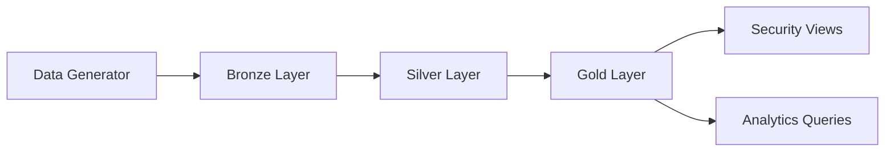

# 🏭 Smart Manufacturing IoT Lakehouse  
### End-to-End Data Engineering Project (Databricks)

---

## 📌 Table of Contents

1. [Executive Summary](#1-executive-summary)  
2. [Problem Statement](#2-problem-statement)  
3. [Architecture Overview](#3-architecture-overview)  
4. [Technology Stack](#4-technology-stack)  
5. [Data Sources](#5-data-sources)  
6. [Medallion Architecture Implementation](#6-medallion-architecture-implementation)  
7. [Data Quality Framework](#7-data-quality-framework)  
8. [Dimensional Modeling (Gold Layer)](#8-dimensional-modeling-gold-layer)  
9. [Security Simulation (RLS & CLS)](#9-security-simulation-rls--cls)  
10. [Performance Optimization Strategy](#10-performance-optimization-strategy)  
11. [Testing & Validation](#11-testing--validation)  
12. [Orchestration Design](#12-orchestration-design)  
13. [Folder Structure](#13-folder-structure)  
14. [How to Run the Project](#14-how-to-run-the-project)  
15. [Key Engineering Decisions](#15-key-engineering-decisions)  
16. [Limitations](#16-limitations)  
17. [Future Improvements](#17-future-improvements)  

---

# 1️⃣ Executive Summary

This project implements a complete **Smart Manufacturing IoT Lakehouse** using **Databricks + Delta Lake**, following the Medallion Architecture (Bronze → Silver → Gold).

The platform simulates a global manufacturing environment where:

- IoT telemetry is generated for equipment
- Production, maintenance, and quality data are processed
- Data Quality rules are enforced
- A dimensional model is built for analytics
- Row-Level and Column-Level security are simulated
- Performance optimization techniques are applied
- Full pipeline orchestration and validation are implemented

---

# 2️⃣ Problem Statement

A global manufacturing company requires a governed and scalable Lakehouse platform capable of:

- Ingesting IoT telemetry and operational datasets  
- Enforcing data quality rules  
- Supporting analytical reporting through dimensional modeling  
- Simulating governance controls (RLS / CLS)  
- Optimizing storage and query performance  
- Providing an orchestrated and testable pipeline  

This project builds that end-to-end system using Databricks and Delta Lake.

---

# 3️⃣ Architecture Overview



Catalog Structure:

```sql
sparkwars.bronze.*
sparkwars.silver.*
sparkwars.gold.*
```

---

# 4️⃣ Technology Stack

- Databricks  
- Delta Lake  
- PySpark  
- Databricks SQL  
- Delta OPTIMIZE + ZORDER  
- Notebook-based orchestration  

---

# 5️⃣ Data Sources

Synthetic datasets are generated using Spark functions.

| Dataset | Description |
|----------|-------------|
| IoT Telemetry | Device-level sensor readings |
| Production Orders | Order-level manufacturing records |
| Maintenance Records | Equipment maintenance activity |
| Quality Inspection | Defect tracking |
| Equipment Master | Equipment reference data |

---

# 6️⃣ Medallion Architecture Implementation

## 🟫 Bronze Layer – Raw Ingestion

- Raw ingestion from landing volumes  
- No transformations applied  
- Stored as Delta tables  
- Append-only pattern  

Example:

```python
df.write.format("delta") \
  .mode("append") \
  .saveAsTable("sparkwars.bronze.iot_telemetry_raw")
```

---

## 🟪 Silver Layer – Cleansing & Validation

Silver applies:

- Null validation  
- Range validation  
- Business rule enforcement  
- Data Quality tagging  
- Violation routing  

### Example DQ Columns

```python
.withColumn("_dq_passed", ...) \
.withColumn("_violation_reason", ...) \
.withColumn("pipeline_run_id", ...)
```

Failed records are written to:

```sql
sparkwars.silver.iot_telemetry_dq_violations
```

---

# 7️⃣ Data Quality Framework

Features:

- Rule tagging during transformation  
- Boolean pass/fail tracking  
- Violation reason capture  
- Separate DQ violations table  
- Referential integrity validation  

Example Referential Integrity Check:

```sql
SELECT qi.order_id
FROM sparkwars.silver.quality_inspection qi
LEFT ANTI JOIN sparkwars.silver.production_orders po
ON qi.order_id = po.order_id;
```

---

# 8️⃣ Dimensional Modeling (Gold Layer)

Gold implements a **Star Schema**.

---

## 📘 Dimensions

### dim_facility
- Surrogate key (IDENTITY)
- Facility attributes

### dim_timestamp
- Pre-generated date dimension (2025–2027)
- Fiscal attributes
- Weekend and month-end indicators

---

## 📕 Facts

Fact tables join Silver datasets with dimension surrogate keys.

Example:

```sql
CREATE TABLE sparkwars.gold.fact_sensor_readings (
  sensor_reading_sk BIGINT GENERATED ALWAYS AS IDENTITY,
  equipment_sk BIGINT,
  facility_sk BIGINT,
  timestamp_sk INT,
  temperature DOUBLE,
  vibration_x DOUBLE
) USING DELTA;
```

---

# 9️⃣ Security Simulation (RLS & CLS)

## 🔒 Row-Level Security

```sql
CREATE OR REPLACE VIEW sparkwars.gold.vw_analyst_sensor_readings AS
SELECT *
FROM sparkwars.gold.fact_sensor_readings
WHERE facility_sk IN (
  SELECT facility_sk
  FROM sparkwars.gold.dim_facility
  WHERE facility_id = current_user()
);
```

---

## 🔐 Column-Level Security

```sql
CONCAT(LEFT(maintenance_technician_id, 5), '***')
```

Separate views are created for analysts (masked) and engineers (unmasked).

---

# 🔟 Performance Optimization Strategy

### OPTIMIZE + ZORDER

```sql
OPTIMIZE sparkwars.silver.iot_telemetry
ZORDER BY (device_id, event_timestamp);
```

### Table Properties

```sql
delta.autoOptimize.optimizeWrite = true
delta.autoOptimize.autoCompact = true
delta.targetFileSize = 134217728
```

Purpose:
- Reduce small files  
- Improve data skipping  
- Enhance join performance  

---

# 11️⃣ Testing & Validation

Validation checks include:

- Source vs Bronze row count  
- Equipment source vs Bronze consistency  
- Structured warning logs  

Example:

```python
if bronze_count != source_count:
    print("WARNING: Row count mismatch")
```

---

# 12️⃣ Orchestration Design

`MASTER_Pipeline_Runner.ipynb`:

- Generates `pipeline_run_id`  
- Logs execution time  
- Executes notebooks sequentially  
- Handles failures  

Example:

```python
dbutils.notebook.run("Bronze_Layer_Data_Ingestion", 0)
```

---

# 13️⃣ Folder Structure

```
Create_Databases.ipynb
Data_Generator.ipynb
Bronze_Layer_Data_Ingestion.ipynb
Silver_Layer_Cleansing_and_Validation.ipynb
DQ_Reporting.ipynb
Gold_Facts_and_Dim.ipynb
Security_Simulation.ipynb
Optimization_Script.ipynb
Testing_and_Validation.ipynb
MASTER_Pipeline_Runner.ipynb
```

---

# 14️⃣ How to Run the Project

1. Run `Create_Databases.ipynb`  
2. Run `Data_Generator.ipynb`  
3. Execute `MASTER_Pipeline_Runner.ipynb`  

This executes the full pipeline end-to-end.

---

# 15️⃣ Key Engineering Decisions

- Medallion architecture for separation of concerns  
- Surrogate keys for dimensional modeling  
- Separate DQ tables for auditability  
- ZORDER for query optimization  
- Notebook-based orchestration for reproducibility  

---

# 16️⃣ Limitations

- CDC merge logic not implemented  
- SCD Type 2 versioning not implemented  
- Streaming ingestion simulated via batch  
- Fine-grained Unity Catalog RBAC not used  

---

# 17️⃣ Future Improvements

- Implement true CDC using MERGE  
- Add SCD Type 2 version tracking  
- Introduce Structured Streaming  
- Enable Delta Change Data Feed  
- Integrate ML-based anomaly detection  
- Add BI dashboard integration  

---

# 🎯 Conclusion

This project demonstrates:

- End-to-end Lakehouse architecture  
- Production-style medallion layering  
- Data quality engineering  
- Dimensional modeling  
- Security simulation  
- Delta optimization  
- Pipeline orchestration  
- Validation framework  

Suitable for:

- Hackathon submissions  
- Portfolio demonstration  
- Technical interviews  
- Production architecture discussions  