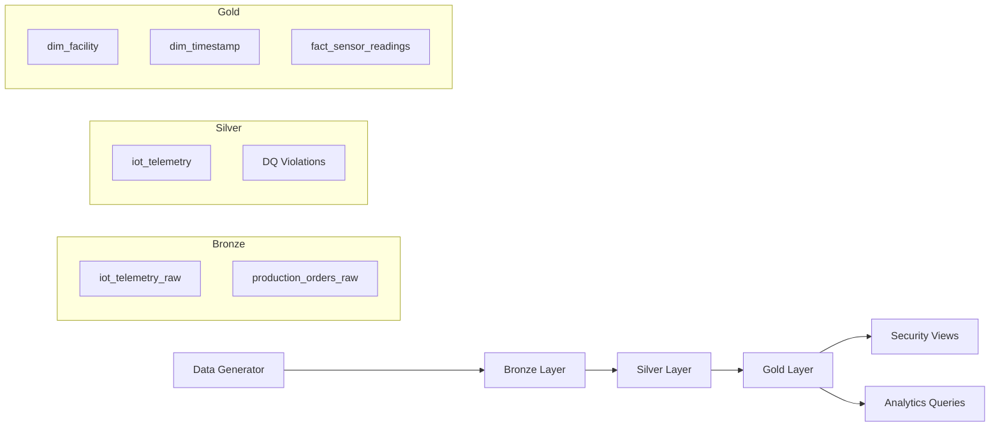

# 🏭 Smart Manufacturing IoT Lakehouse  
### End-to-End Data Engineering Platform (Databricks + Delta Lake)

---

## 📌 Table of Contents

1. Project Overview  
2. Problem Statement  
3. Architecture Overview  
4. Medallion Architecture Design  
5. Data Sources & Synthetic Data Strategy  
6. Folder & Notebook Structure  
7. Phase-by-Phase Implementation  
8. Data Quality Framework  
9. Gold Layer Dimensional Model  
10. Security & Governance Simulation  
11. Performance Optimization Strategy  
12. Testing & Validation Strategy  
13. Orchestration Design  
14. Architecture Diagram (Mermaid)  
15. Key Engineering Decisions  
16. Limitations  
17. Future Enhancements  

---

# 1️⃣ Project Overview

This project implements a governed, scalable **Smart Manufacturing IoT Lakehouse** using:

- Databricks
- Delta Lake
- PySpark
- SQL

The platform simulates a global manufacturing company processing:

- IoT equipment telemetry
- Production orders
- Maintenance records
- Quality inspection data
- Equipment master data

The architecture follows a strict **Medallion (Bronze → Silver → Gold)** pattern and includes:

- Data Quality validation framework  
- Dimensional modeling (Star Schema)  
- Security simulation (Row-Level & Column-Level)  
- Delta Lake performance optimization  
- Full pipeline orchestration  
- Validation & testing  

---

# 2️⃣ Problem Statement

A global manufacturing organization requires a Lakehouse platform that:

- Ingests multi-source operational data  
- Preserves raw data integrity  
- Enforces data quality standards  
- Supports analytical reporting  
- Implements access controls  
- Optimizes performance for analytics workloads  
- Provides reproducible orchestration  

This project delivers that architecture using Databricks.

---

# 3️⃣ Architecture Overview

### Catalog Structure

All objects are created under:

```
sparkwars.bronze.*
sparkwars.silver.*
sparkwars.gold.*
```

### Logical Data Flow

1. Synthetic data generation
2. Bronze ingestion (raw Delta tables)
3. Silver cleansing + DQ enforcement
4. Gold star schema modeling
5. Security view creation
6. Optimization
7. Testing & validation

---

# 4️⃣ Medallion Architecture Design

---

## 🟫 Bronze Layer — Raw Data Ingestion

**Purpose:** Preserve source data exactly as received.

### Characteristics:

- Append-only Delta tables  
- No business transformations  
- Raw schema preservation  
- Minimal metadata enrichment  

Example:

```python
df.write.format("delta") \
  .mode("append") \
  .saveAsTable("sparkwars.bronze.iot_telemetry_raw")
```

Bronze Tables:

- iot_telemetry_raw
- production_orders_raw
- maintenance_records_raw
- quality_inspection_raw
- equipment_master_raw

---

## 🟪 Silver Layer — Cleansing & Validation

**Purpose:** Enforce business rules and ensure data integrity.

### Implemented Transformations:

- Null validation  
- Range validation  
- Required field enforcement  
- DQ tagging columns  
- Violation routing  
- Referential integrity checks  
- Pipeline run tracking  

### DQ Columns Added

```
_dq_passed
_violation_reason
pipeline_run_id
```

Records failing rules are written to:

```
sparkwars.silver.iot_telemetry_dq_violations
```

This ensures no silent data loss.

---

## 🟨 Gold Layer — Dimensional Modeling

**Purpose:** Provide analytics-ready star schema.

### Design Principles:

- Surrogate keys (IDENTITY)
- Fact + Dimension separation
- Join-ready model
- Optimized for reporting queries

---

# 5️⃣ Data Sources & Synthetic Data Strategy

Data is generated using Spark-native random functions:

- Random facility assignment
- Random equipment types
- Timestamp generation within recent range
- Metric distributions:
  - temperature
  - vibration_x
  - pressure
  - rpm
  - power consumption

Data is written to Volume paths before Bronze ingestion.

This allows full control over test scenarios.

---

# 6️⃣ Folder & Notebook Structure

```
Create_Databases.ipynb
Data_Generator.ipynb
Bronze_Layer_Data_Ingestion.ipynb
Silver_Layer_Cleansing_and_Validation.ipynb
DQ_Reporting.ipynb
Gold_Facts_and_Dim.ipynb
Security_Simulation.ipynb
Optimization_Script.ipynb
Testing_and_Validation.ipynb
MASTER_Pipeline_Runner.ipynb
```

Each notebook is modular and idempotent.

---

# 7️⃣ Phase-by-Phase Implementation

---

## Phase 1 — Environment Setup

- Create catalog & schemas
- Initialize Delta structure

---

## Phase 2 — Data Generation

- Generate synthetic datasets
- Write to managed volume paths

---

## Phase 3 — Bronze Ingestion

- Load raw files
- Append to Delta Bronze tables

---

## Phase 4 — Silver Cleansing

IoT Silver Rules:

| Rule | Validation |
|------|-----------|
| device_id NOT NULL | Required |
| event_timestamp NOT NULL | Required |
| facility_id NOT NULL | Required |
| temperature between -50 and 150 | Range |
| vibration_x between 0 and 100 | Range |

Referential Integrity Example:

```sql
SELECT qi.order_id
FROM sparkwars.silver.quality_inspection qi
LEFT ANTI JOIN sparkwars.silver.production_orders po
ON qi.order_id = po.order_id;
```

---

## Phase 5 — Gold Modeling

### Dimensions

- dim_facility (surrogate key)
- dim_timestamp (2025–2027 pre-generated)

### Facts

- fact_sensor_readings
- fact_production_output
- fact_maintenance_events

Example:

```sql
CREATE TABLE sparkwars.gold.fact_sensor_readings (
  sensor_reading_sk BIGINT GENERATED ALWAYS AS IDENTITY,
  equipment_sk BIGINT,
  facility_sk BIGINT,
  timestamp_sk INT,
  temperature DOUBLE,
  vibration_x DOUBLE
) USING DELTA;
```

---

# 8️⃣ Data Quality Framework

Features:

- Rule-level tagging  
- Pass/Fail classification  
- Violation reason capture  
- Dedicated DQ table  
- Cross-table validation  

This provides full traceability of rejected data.

---

# 9️⃣ Security & Governance Simulation

## Row-Level Security (RLS)

```sql
CREATE OR REPLACE VIEW sparkwars.gold.vw_analyst_sensor_readings AS
SELECT *
FROM sparkwars.gold.fact_sensor_readings
WHERE facility_sk IN (
  SELECT facility_sk
  FROM sparkwars.gold.dim_facility
  WHERE facility_id = current_user()
);
```

---

## Column-Level Security (CLS)

Masked technician IDs:

```sql
CONCAT(LEFT(maintenance_technician_id, 5), '***')
```

Separate views for analysts vs engineers.

---

# 🔟 Performance Optimization Strategy

### OPTIMIZE + ZORDER

```sql
OPTIMIZE sparkwars.silver.iot_telemetry
ZORDER BY (device_id, event_timestamp);
```

### Table Properties

```
delta.autoOptimize.optimizeWrite = true
delta.autoOptimize.autoCompact = true
delta.targetFileSize = 134217728
```

Goals:

- Reduce small files
- Improve data skipping
- Enhance join performance

---

# 11️⃣ Testing & Validation Strategy

Validation includes:

- Source vs Bronze row count comparison  
- Equipment consistency validation  
- Structured warning messages  

Example:

```python
if bronze_count != source_count:
    print("WARNING: Row count mismatch")
```

Testing is executed after pipeline completion.

---

# 12️⃣ Orchestration Design

MASTER_Pipeline_Runner:

- Generates UUID pipeline_run_id  
- Executes notebooks sequentially  
- Logs execution duration  
- Stops on failure  

Example:

```python
dbutils.notebook.run("Silver_Layer_Cleansing_and_Validation", 0)
```

This ensures reproducibility and control.

---

# 13️⃣ Architecture Diagram (Mermaid)



---

# 14️⃣ Key Engineering Decisions

- Strict Medallion separation  
- Surrogate keys for dimensional modeling  
- Dedicated DQ violation tables  
- ZORDER for high-cardinality columns  
- Notebook-based orchestration for deterministic execution  

---

# 15️⃣ Limitations

- CDC merge logic not implemented  
- SCD Type 2 not implemented  
- Structured Streaming not used  
- Fine-grained Unity Catalog RBAC not enabled  

---

# 16️⃣ Future Enhancements

- Implement MERGE-based CDC  
- Add SCD Type 2 versioning  
- Enable Change Data Feed  
- Introduce streaming ingestion  
- Add ML anomaly detection  
- Integrate BI dashboard layer  

---

# 🎯 Conclusion

This project demonstrates:

- End-to-end Lakehouse architecture  
- Data quality engineering  
- Dimensional modeling best practices  
- Security simulation  
- Delta optimization  
- Orchestrated pipelines  
- Structured validation  

It reflects production-oriented Data Engineering design patterns suitable for enterprise environments.
